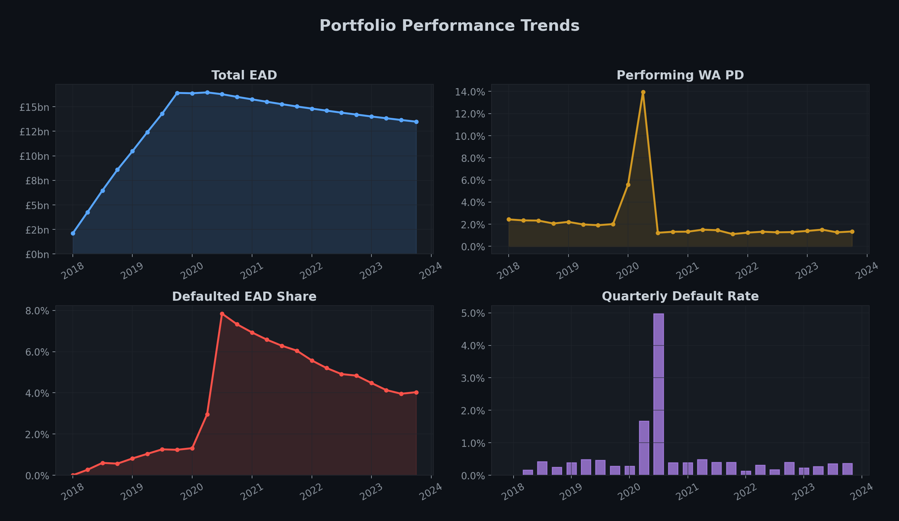
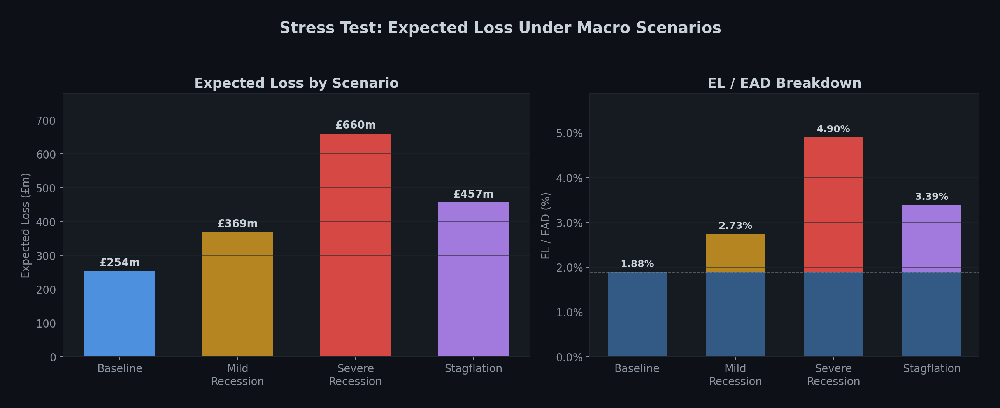
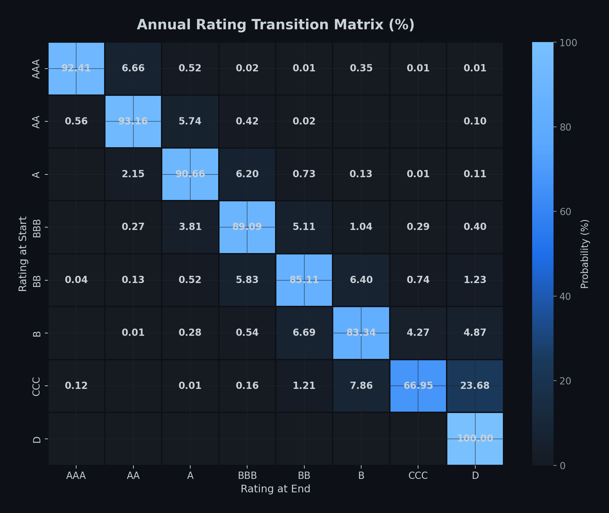
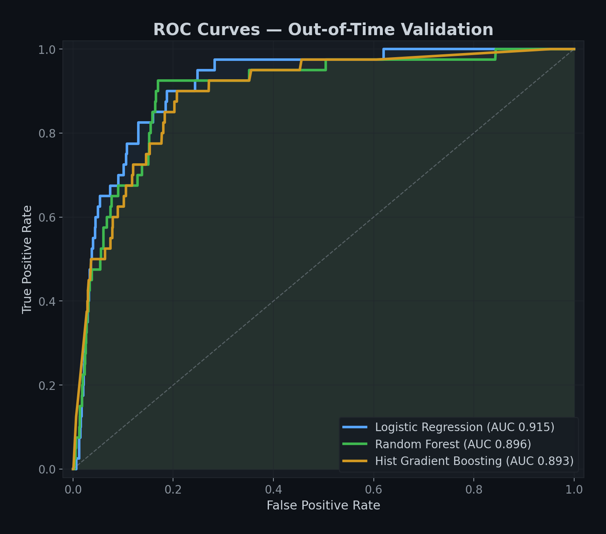
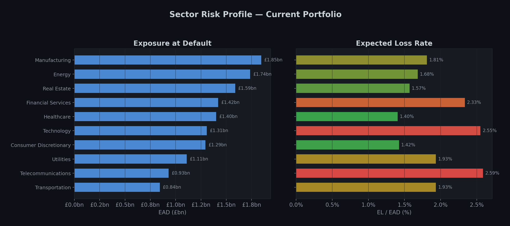

# Wholesale Credit Risk Portfolio Analytics

An end-to-end, reproducible demonstration of wholesale portfolio surveillance: concentration,
rating migration, default performance, emerging-risk watchlists, macro-linked PD modelling,
scenario stress testing, model validation, SQL controls and unstructured risk signals.

The default portfolio is synthetic by design. The project demonstrates analytical method and
engineering discipline without implying that synthetic estimates are suitable for lending,
capital, regulatory or accounting decisions.

I built this project to demonstrate how I would approach wholesale portfolio surveillance as an
analyst: start with reconciled exposure and rating histories, make the event timing explicit, test
models out of time, and finish with a report that separates measured results from assumptions.

## Executive result

The default seeded run creates a six-year quarterly panel of **2,500 obligors**, **51,182
obligor-quarters**, **305 new defaults** and **£13.48bn current EAD**. It completes locally in about
30 seconds on a laptop and produces a management report, validation tables, SQL outputs and charts.

Current illustrative findings:

- Performing weighted-average one-year PD is **1.34%** and performing EL/EAD is **0.46%**.
- The largest sector is **Manufacturing (13.7% of EAD)**; the top 20 names are **4.7%**.
- The watchlist is **15.1% of EAD**, marginally above the illustrative 15% appetite.
- Severe-recession EL/EAD rises from **1.88% to 4.90%**; Energy, Real Estate and Manufacturing
  are the largest incremental-loss contributors.
- The champion logistic model achieves **0.915 OOT AUC** and **0.027 average precision** versus a
  0.003 event-rate baseline. Its calibration intercept/slope are **0.796 / 1.123**, which is reported
  transparently as a recalibration consideration rather than hidden behind discrimination.

Read the [executive summary](reports/executive_summary.md) for actions and limitations.

### Portfolio performance



### Stress testing



### Rating migration



### Model validation



### Sector risk profile



## What is implemented

| Capability | Implementation and control |
|---|---|
| Portfolio performance | Quarterly EAD, EL, rating mix, at-risk default rates and rules-based watchlist |
| Concentration | Sector/rating/geography HHI, name concentration, Lorenz curve and sector-rating heatmap |
| Rating migration | Empirical quarterly matrix, annual matrix via `P^4`, obligor-cluster bootstrap confidence intervals and censoring-aware cumulative default rates |
| Stress testing | PD, LGD/collateral and revolver-EAD channels across baseline, recession and stagflation scenarios; sector contribution analysis |
| Macro/industry PD | Information at quarter `t` predicts default at `t+1`; grouped CV by obligor and strict date-based OOT testing |
| Validation | ROC AUC/Gini, average precision, Brier score, KS, calibration intercept/slope, Hosmer-Lemeshow and heterogeneous-PD grade traffic lights |
| SQL | Constrained schema, indexes, transition log and six named control/management queries executed in the main workflow |
| Unstructured signals | Deterministic offline classifier by default; optional zero-shot model is clearly labelled and isolated as an extra dependency |
| Governance | Central config, fixed seed, logs, run manifest, unit controls, linting and a full-pipeline CI gate |

## Design

```text
Synthetic panel + optional FRED
            │
            ▼
  Validated SQLite layer ─────► named SQL controls
            │
      ┌─────┼────────┬──────────────┐
      ▼     ▼        ▼              ▼
 performance  migration  concentration  watchlist
      └─────┬────────┴───────┬──────┘
            ▼                ▼
       stress engine     PD models
                             │
                             ▼
                    OOT validation/backtest
            │                │
            └────────┬───────┘
                     ▼
             management summary
```

Default is absorbing. The data generator records the beginning-of-quarter state before applying
the next transition, so event timing, denominators and the `t → t+1` model target remain distinct.
The quarterly base matrix is the fourth root of the stated annual matrix; a unit control verifies
that compounding it four times reproduces the annual source matrix.

## Quick start

Python 3.10 or 3.11 is recommended.

```bash
git clone https://github.com/Leotaby/Wholesale-Credit-Risk-Portfolio-Analytics.git
cd Wholesale-Credit-Risk-Portfolio-Analytics
python -m venv .venv
source .venv/bin/activate
python -m pip install --upgrade pip
pip install -r requirements.txt
python main.py
```

No API key or network access is required. If `FRED_API_KEY` is present, the ingestion layer attempts
to retrieve public macro series; otherwise it uses the reproducible built-in macro path.

Useful commands:

```bash
# Faster analytics-only run
python main.py --skip-models --skip-llm

# Quality gates used by CI
pip install -r requirements-dev.txt
ruff check .
pytest --cov=src --cov-report=term-missing --cov-fail-under=55

# Optional model-based text classification
pip install -r requirements-llm.txt
# set llm.mode: bart_zero_shot in config.yaml

# Optional fourth PD model
pip install -r requirements-xgboost.txt
# then add xgboost under macro_model.models in config.yaml
```

The main run recreates `data/credit_risk.db` and updates generated files in `reports/`.

## Repository map

```text
├── main.py                         # orchestrated eight-stage run
├── config.yaml                     # seed, scenarios, limits and paths
├── src/                            # reusable analytical modules
├── sql/
│   ├── schema.sql                  # constrained relational schema and indexes
│   └── analytics_queries.sql       # named queries exercised by main.py
├── tests/                          # unit and analytical-invariant controls
├── notebooks/                      # executed reviewer walkthroughs
├── docs/
│   ├── METHODOLOGY.md
│   ├── MODEL_CARD.md
│   └── DATA_DICTIONARY.md
└── reports/                        # curated management output and figures
```

## Reproducibility and extension

- The run seed and package/runtime versions are written to `reports/run_manifest.json`.
- The SQLite database and intermediate CSVs are generated artifacts and intentionally ignored.
- Optional dependencies are separated so the core offline run remains portable.
- The schema and modules are designed for substitution of governed internal data, but the current
  pandas/SQLite implementation is a demonstrator, not a claim of enterprise-scale infrastructure.
- For large portfolios, preserve the analytical contracts while moving persistence and aggregation
  to a warehouse/Spark engine and adding as-of joins, lineage, access controls and reconciliation.

Detailed assumptions, equations and limitations are in [METHODOLOGY.md](docs/METHODOLOGY.md). Model
governance is documented in [MODEL_CARD.md](docs/MODEL_CARD.md), and field definitions are in
[DATA_DICTIONARY.md](docs/DATA_DICTIONARY.md).

## Licence

MIT. No proprietary data, code or methodology is included or implied.

## Author

Hatef Taby

[GitHub](https://github.com/Leotaby) · [LinkedIn](https://www.linkedin.com/in/hateftaby/) ·
[tabbakhianhatef@gmail.com](mailto:tabbakhianhatef@gmail.com)
